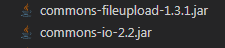

jar



web.xml
```
<?xml version="1.0" encoding="UTF-8"?>
<web-app version="3.0" xmlns="http://java.sun.com/xml/ns/javaee"
	xmlns:xsi="http://www.w3.org/2001/XMLSchema-instance"
	xsi:schemaLocation="http://java.sun.com/xml/ns/javaee                       
	http://java.sun.com/xml/ns/javaee/web-app_3_0.xsd">
	<!-- 上下文参数 -->
	<context-param>
		<param-name>contextConfigLocation</param-name>
		<param-value>classpath:applicationContext.xml</param-value>
	</context-param>
	<!-- 监听器 -->
	<listener>
		<listener-class>org.springframework.web.context.ContextLoaderListener</listener-class>
	</listener>
	<!-- SpringMVC前端控制器 -->
	<servlet>
		<servlet-name>springmvc</servlet-name>
		<servlet-class>org.springframework.web.servlet.DispatcherServlet</servlet-class>
		<init-param>
			<param-name>contextConfigLocation</param-name>
			<param-value>classpath:springmvc.xml</param-value>
		</init-param>
		<load-on-startup>1</load-on-startup>
	</servlet>
	<servlet-mapping>
		<servlet-name>springmvc</servlet-name>
		<url-pattern>/</url-pattern>
	</servlet-mapping>
	<!-- 字符编码过滤器 -->
	<filter>
		<filter-name>encoding</filter-name>
		<filter-class>org.springframework.web.filter.CharacterEncodingFilter</filter-class>
		<init-param>
			<param-name>encoding</param-name>
			<param-value>utf-8</param-value>
		</init-param>
	</filter>
	<filter-mapping>
		<filter-name>encoding</filter-name>
		<url-pattern>/*</url-pattern>
	</filter-mapping>
</web-app>
```

spring配置文件applicationContext.xml
```
<?xml version="1.0" encoding="UTF-8"?>
<beans xmlns="http://www.springframework.org/schema/beans"
	xmlns:xsi="http://www.w3.org/2001/XMLSchema-instance" 
	xmlns:aop="http://www.springframework.org/schema/aop"
	xmlns:tx="http://www.springframework.org/schema/tx" 
	xmlns:context="http://www.springframework.org/schema/context"
	xsi:schemaLocation="http://www.springframework.org/schema/beans
        http://www.springframework.org/schema/beans/spring-beans.xsd
        http://www.springframework.org/schema/aop
        http://www.springframework.org/schema/aop/spring-aop.xsd
        http://www.springframework.org/schema/context
        http://www.springframework.org/schema/context/spring-context.xsd
        http://www.springframework.org/schema/tx
        http://www.springframework.org/schema/tx/spring-tx.xsd" default-autowire="byName">
    <!-- 注解扫描 -->
    <context:component-scan base-package="com.bjsxt.service.impl"></context:component-scan>
    <!-- 加载属性文件 -->
    <context:property-placeholder location="classpath:db.properties"/>
    <!-- 数据源 -->
    <bean id="dataSource" class="org.springframework.jdbc.datasource.DriverManagerDataSource">
    	<property name="driverClassName" value="${jdbc.driver}"></property>
    	<property name="url" value="${jdbc.url}"></property>
    	<property name="username" value="${jdbc.username}"></property>
    	<property name="password" value="${jdbc.password}"></property>
    </bean>
    <!-- SqlSessionFactory -->
    <bean id="factory" class="org.mybatis.spring.SqlSessionFactoryBean">
    	<property name="dataSource" ref="dataSource"></property>
    	<property name="typeAliasesPackage" value="com.bjsxt.pojo"></property>
    </bean>
    <!-- 扫描器 -->
    <bean class="org.mybatis.spring.mapper.MapperScannerConfigurer">
    	<property name="basePackage" value="com.bjsxt.mapper"></property>
    	<property name="sqlSessionFactoryBeanName" value="factory"></property>
    </bean>
    <!-- 事务管理器 -->
    <bean id="txManage" class="org.springframework.jdbc.datasource.DataSourceTransactionManager">
    	<property name="dataSource" ref="dataSource"></property>
    </bean>
    <!-- 声明式事务 -->
    <tx:advice id="txAdvice" transaction-manager="txManage">
    	<tx:attributes>
    		<tx:method name="ins*"/>
    		<tx:method name="del*"/>
    		<tx:method name="upd*"/>
    		<tx:method name="*" read-only="true"/>
    	</tx:attributes>
    </tx:advice>
    <!-- 配置aop -->
    <aop:config>
    	<aop:pointcut expression="execution(* com.bjsxt.service.impl.*.*(..))" id="mypoint"/>
    	<aop:advisor advice-ref="txAdvice" pointcut-ref="mypoint"/>
    </aop:config>
</beans>
```
springmvc.xml 新增MutipartResolver解析器
```
<?xml version="1.0" encoding="UTF-8"?>
<beans xmlns="http://www.springframework.org/schema/beans"
	xmlns:xsi="http://www.w3.org/2001/XMLSchema-instance" 
	xmlns:mvc="http://www.springframework.org/schema/mvc"
	xmlns:context="http://www.springframework.org/schema/context"
	xsi:schemaLocation="http://www.springframework.org/schema/beans
        http://www.springframework.org/schema/beans/spring-beans.xsd
        http://www.springframework.org/schema/context
        http://www.springframework.org/schema/context/spring-context.xsd
        http://www.springframework.org/schema/mvc
        http://www.springframework.org/schema/mvc/spring-mvc.xsd">
    <!-- 扫描注解 -->
    <context:component-scan base-package="com.bjsxt.controller"></context:component-scan>
    <!-- 注解驱动 -->
    <mvc:annotation-driven></mvc:annotation-driven>
    <!-- 静态资源 -->
    <mvc:resources location="/js/" mapping="/js/**"></mvc:resources>
    <mvc:resources location="/images/" mapping="/images/**"></mvc:resources>
    <mvc:resources location="/files/" mapping="/files/**"></mvc:resources>
    <!-- Mutilpart解析器 -->
    <bean id="multipartResolver" class="org.springframework.web.multipart.commons.CommonsMultipartResolver"></bean>
</beans>
```

controller upload and download
```
@RequestMapping("upload")
	public String upload(Users users,MultipartFile file,HttpServletRequest req){
		String fileName = UUID.randomUUID().toString()+file.getOriginalFilename().substring(file.getOriginalFilename().lastIndexOf("."));
		String path = req.getServletContext().getRealPath("images")+"/"+fileName;
		try {
			FileUtils.copyInputStreamToFile(file.getInputStream(), new File(path));
                        return "index";

		} catch (IOException e) {
			e.printStackTrace();
		}
		return "error";
	}

@RequestMapping("download")
	public void download(int id,String name,HttpServletResponse res,HttpServletRequest req) throws IOException{
		filesServiceImpl.updCount(id,(Users)req.getSession().getAttribute("user"),name);
		res.setHeader("Content-Disposition", "attachment;filename="+name);
		ServletOutputStream os = res.getOutputStream();
		File file = new File(req.getServletContext().getRealPath("files"),name);
		os.write(FileUtils.readFileToByteArray(file));
		os.flush();
		os.close();
	}

```